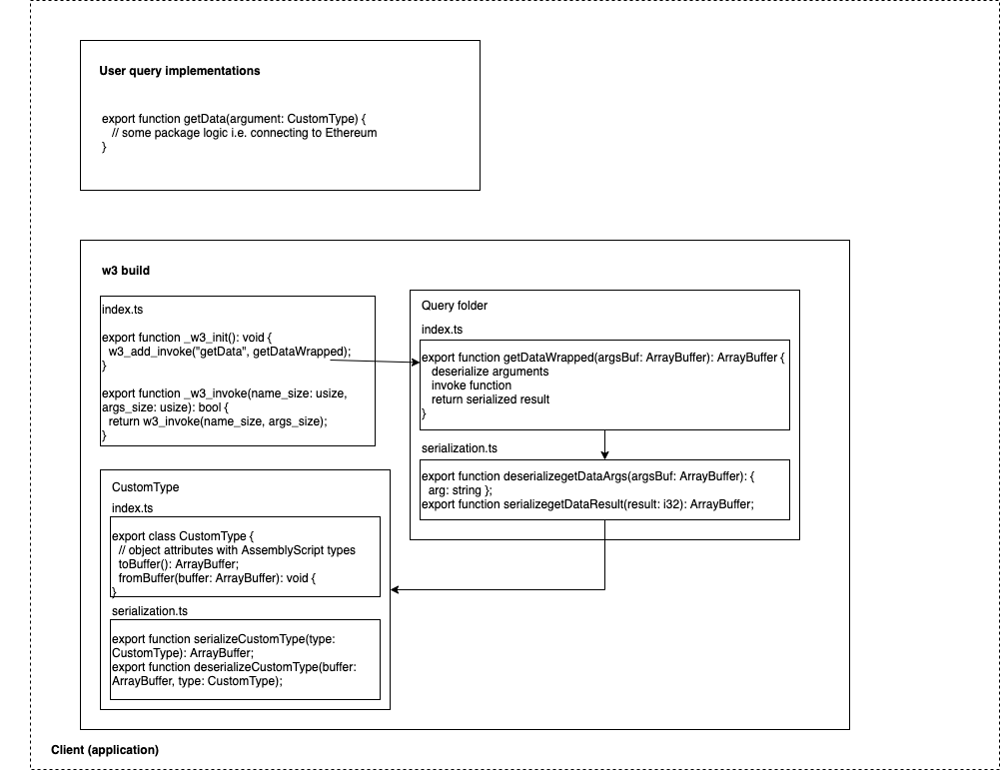

# W3 WASM Protocol
This module contains all host imports required for querying and invoking functions.

It produces a generated code which is used to handle a number of things for the Web3API developers such as:
 - serialization and deserialization of datatypes
 - implementing the `_w3_call` standard for allowing the host to call query methods
 - wrapping the query methods so that arguments are deserialized before being passed into developer's function
 - importing data types & queries from external modules.
 
## Data serialization
[msgpack](https://msgpack.org) is used for data serialization and deserialization between WASM and host language.
This common data format enables representing data types correctly within both areas.

All **user (package) methods** are wrapped (new functions are generated) with arguments deserialization and serialization of the return data.
This map of function pointers is created on [module initialization](#module-initialization). 

**Objects** can be passed as arguments to functions. For those objects new map is created that contains all object's properties with
additional methods for object serialization and deserialization.
There are two cases that are handled:
* generating *imported* query and object types
* generating *user* query and object types

The following drawing demonstrates the flow and structure of a query serialization use case.


## Naming conventions

There are several naming conventions used in Web3API development. Those are:
* #### Host import
All hosts imports are prefixed with two underscores (`__`) i.e. `__w3_invoke_args`.

* #### Module export
All exported methods from WASM modules are prefixed with one underscore (`_`) i.e. `_w3_invoke`.

## Module initialization

WASM module can be initialized in the client by calling the exported `_w3_init` method that each module exposes.
This method enables the usage of wrapped functions from the module.

```js
export function _w3_init(): void {
  w3_add_invoke("queryMethod", queryMethodWrapped);
}

```
## Querying Web3APIs from module
To enable instant usage of WASM module (package) functions, serialization and deseralization of the function data is already built in for each.
This is done by wrapping each function with custom serialization.
Those wrapped functions are added to the w3's `invokes` map that keeps track of all invokable functions and their implementations.

When WASM routine invocation is performed from the host the following steps are taken:
1. Function name and arguments are deserialized
2. Function is retrieved from the implementation mapping and called
3. Result or error is serialized and returned

Invoke function interface:
```
_w3_invoke(name_size: usize, args_size: usize): bool;
```

## Methods imported from host
TBD
```
// Query API
export declare function __w3_query(
  uri_ptr: i32, uri_len: usize,
  query_ptr: i32, query_len: usize,
  args_ptr: i32, args_len: usize
): bool;

// Query Result
export declare function __w3_query_result_len(): usize;
export declare function __w3_query_result(ptr: i32): void;

// Query Error
export declare function __w3_query_error_len(): usize;
export declare function __w3_query_error(ptr: i32): void;
```
