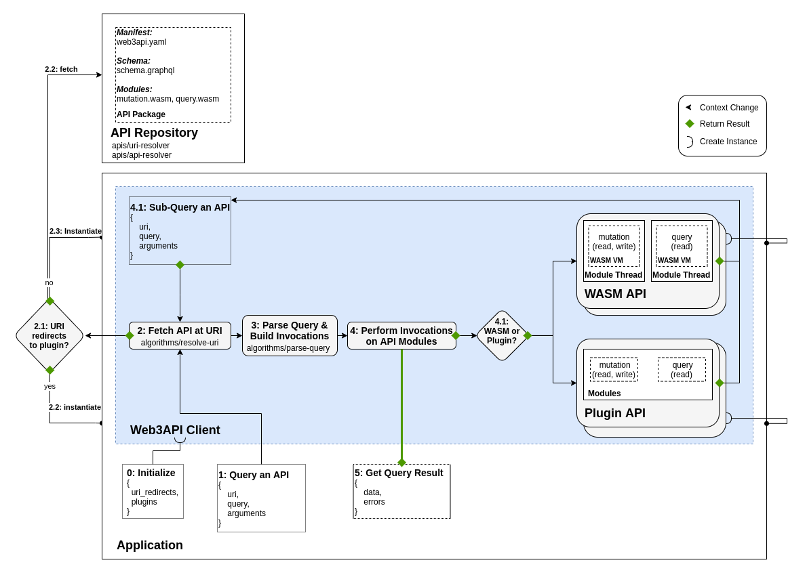

# Architecture Overview
Web3API's high-level architecture, as it pertains to Web3API-enabled applications, is as follows:

## Components

- [Web3API Client](../components/Web3API_Client.md) - Execution Environment  
- [Web3API URI](../components/Web3API_URI.md) - Univeral Identifier  
- [Web3API Package](../components/Web3API_Package.md) - Descriptive & Executable Resources
- [Web3API Plugins](../components/Web3API_Plugins.md) - Non-WASM Based Web3APIs
- [Web3API WASM Protocol](../components/Web3API_WASM_Protocol.md) - { Client <> WASM Module } Communication Protocol

## Step-By-Step Walkthrough

### **0: Initialize**  
Firstly, applications must have a [Web3API Client](../components/Web3API_Client.md) bundled within their applications. When creating a Web3API Client instance, you may [provide additional URI redirects and plugins](TODO). Web3API Client's should provide the recommended [default redirects and plugins](TODO), enabling out of the box usability.  

### **1: Query an API**  
Applications can query an API by specifying what API to query using a [Web3API URI](../components/Web3API_URI.md), along with a GraphQL query.

URIs can be of any type, as long as there exists a compatible `uri-resolver`. The most common URI types are ENS domains (`w3://ens/domain.eth`) and IPFS hashes (`w3://ipfs/QmHASH`).  

GraphQL is the default query language of Web3API clients. Other formats can be supported, such as a simple web request format (ex: `w3://ens/api.eth/mutation/method&arg=5`).

Details on the client's query interface can be found [here](TODO).

### **2: Fetch API at URI**  

[Web3API URIs](../components/Web3API_URI.md) are resolved based on the [Web3API Client](../components/Web3API_Client.md)'s [resolve-uri algorithm](../components/Web3API_Client.md#algorithms-resolve-uri).  

In cases where the URI is being redirected to a [plugin](../components/Web3API_Plugins.md), a new plugin instance is instantiated.  

Otherwise, a [URI resolver](TODO) must be found for the provided [URI authority](TODO). This URI resolver is then used to fetch either another URI, or the [Web3API Package's manifest](TODO). Upon receiving the manifest, we now know that the current URI resolver also implements the [API resolver]() standard interface. Using the API resolver, we are able to fetch the API's schema and WASM modules. We now have enough to instantiate the WASM Web3API instance.  

For example, an ENS domain may resolve to an IPFS hash, which then resolves to a Web3API Package's manifest. For a detailed step by step breakdown of how this works, see the [resolve-uri algorithm specification]((../components/Web3API_Client.md#algorithms-resolve-uri)).  

### **3: Parse Query & Build Invocations**  

With the API's URI resolved, we now must parse the query provided by the user. This is done using the [parse-query algorithm](../components/Web3API_Client.md#algorithms-parse-query). The algorithm outputs one or more [invocation configurations](TODO), which details what: module, method, input arguments, and requested results will be called by the client.  

### **4: Perform Invocations on API Modules**  

Each of the query's invocations are then performed on the API in question. Within the invocation, one or more sub-queries may be performed on other Web3APIs.  

### **5: Get Query Result**  

The aggregate result of all invocations will then be returned back to the application, including any errors encountered.  
